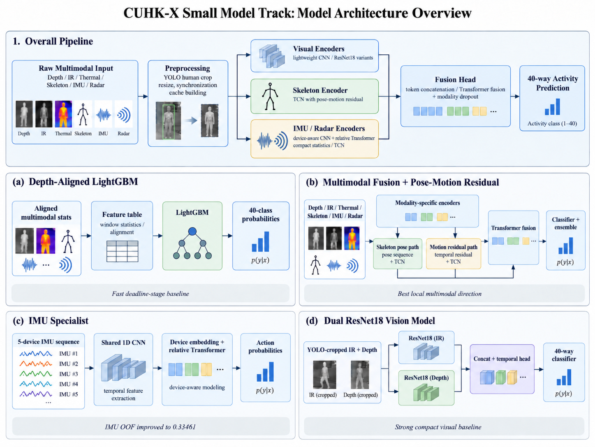

# CUHK-X Small Model Track: Lightweight HAR

## Introduction

This repository contains a Human Activity Recognition solution for the CUHK-X Kaggle Competition Small Model Track. The task is to predict one of 40 actions from six modalities: IR, Depth_Color, Thermal, Skeleton, IMU and Radar. Models are evaluated with subject-held-out validation to measure cross-user generalization. A submitted inference package, including any person detector, must stay below the 100 MB model-size limit.

The repository preserves two protocols: historical three-fold development in `manifests/cv3/`, and the frozen five-fold subject-held-out protocol in `manifests/cv5/`. Their scores are reported separately and must not be ranked against one another.

## Results

| Result | Protocol and metric | Accuracy | Notes |
| --- | --- | ---: | --- |
| LightGBM + YOLO-box temporal features, box baseline | cv5 selected folds 2 and 4, validation-size weighted | **0.51949** | Best measured Sep14 selected-fold result; fold 2: 0.55926, fold 4: 0.48594. |
| Dual ResNet-18 with moderate clip-consistent augmentation | cv5 selected folds 2 and 4, validation-size weighted | **0.39748** | Best visual-only result; fold 2: 0.44259, fold 4: 0.35938. |
| Synced-flip baseline + pose-motion residual blend | cv5 five-fold cross-fitted OOF | **0.49736** | Conservative full-CV blend estimate; the pooled OOF blend is 0.50198. |

The complete chronology, fold scores, failures and interpretation through Sep14 are recorded in [docs/EXPERIMENTS.md](docs/EXPERIMENTS.md).

## Architecture

The pipeline aligns and cleans each modality before compact, modality-specific encoders produce the features used by LightGBM or multimodal fusion. The full model guide, diagrams, validation protocols, and checkpoint roles are in [docs/Architecture.md](docs/Architecture.md).

## Reproduction

Start from the repository root, install the locked environment, and keep the competition data at the paths documented in the reproduction guide.

Detailed, result-specific commands are in [docs/Reproduction.md](docs/Reproduction.md). They cover data caches, fold-safe YOLO crops, training, OOF checks, blending and official submission validation for each result above.
