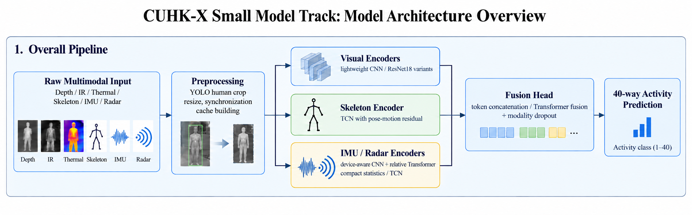
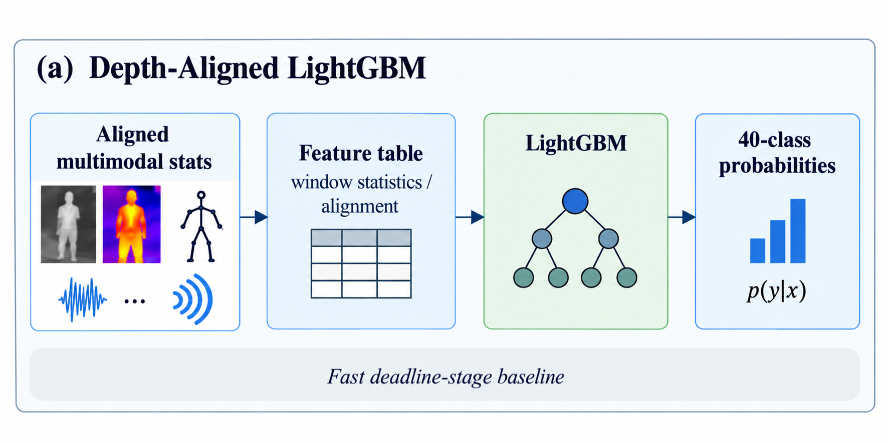
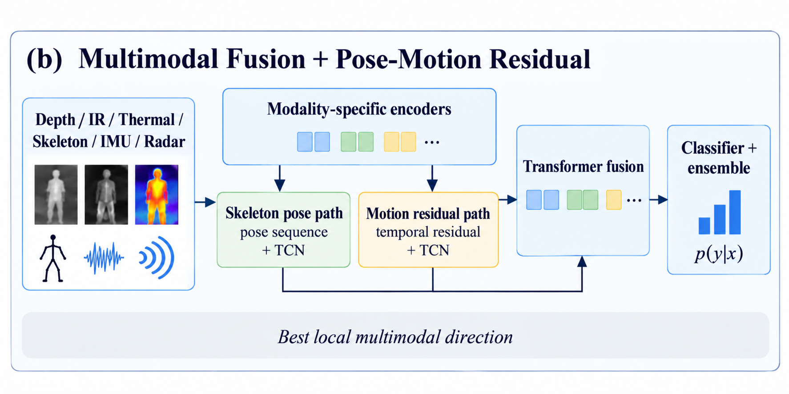
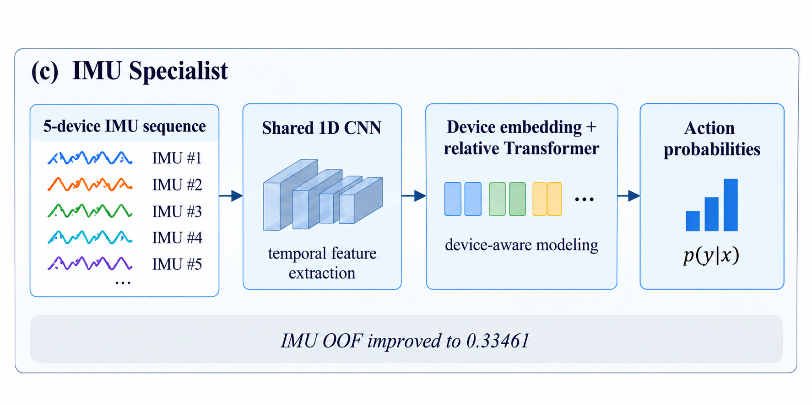
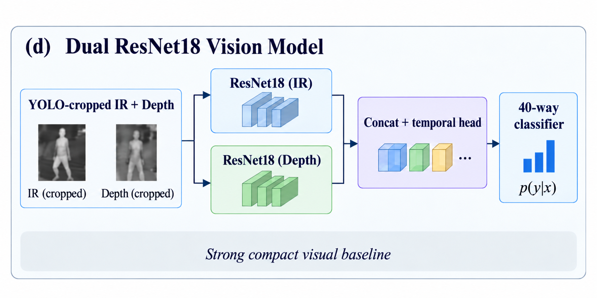

# Architecture overview

## Task and data

CUHK-X Small Model Track classifies 40 activities from six synchronized but heterogeneous streams: Depth_Color, IR, Thermal, Skeleton, IMU, and Radar. The principal evaluation is five-fold subject-held-out validation. A model is therefore assessed on users that were absent from its training partition.

## Preprocessing and inference flow

Visual streams are temporally sampled and aligned. A fold-safe YOLOv8n person detector crops each visual modality independently before it is resized. The Skeleton sequence is converted to normalized 17-joint pose features; five IMU devices are synchronized to a shared time grid; and sparse Radar point clouds are summarized as temporal statistics. Caches make these deterministic steps reusable across experiments.

The project evaluates models conservatively: Fold 2 and Fold 4 are selected screens for the YOLO-based systems, whereas the multimodal fusion result is a complete five-fold cross-fitted OOF estimate. These protocols must not be treated as interchangeable.

## Depth-aligned LightGBM with YOLO-box features

The strongest selected-fold model combines sensor summaries, three cropped visual-stream summaries, and temporal geometry derived from YOLO boxes. Box features include detection coverage, centre, width, height, first/last values, change, and average motion. A compact LightGBM then predicts the 40 actions.

The measured box-feature baseline reached 0.55926 on Fold 2 and 0.48594 on Fold 4, or **0.51949** when weighted by validation-set size. The full-data model uses a full-data YOLO detector only after validation is complete.

## Multimodal fusion and pose-motion residual branch

The five-fold multimodal system uses modality-specific visual CNN, Skeleton, IMU, and Radar encoders. Their embeddings are fused by a small Transformer head. Modality dropout and synchronized flip augmentation prevent the fusion head from relying only on Skeleton.

The pose-motion residual variant retains the direct Skeleton representation and adds velocity and acceleration through a learned residual gate. This improved the standalone five-fold OOF score from 0.47332 to 0.48650.

The reported 0.50+ fusion result is an ensemble, not one checkpoint: five baseline folds contribute 0.05 each and five pose-motion folds contribute 0.15 each. Its pooled OOF is 0.50198 and its more conservative cross-fitted OOF is **0.49736**.

## Device-aware IMU specialist

The IMU branch preserves the identity of the five wearable devices. Shared local convolutions encode short-range motion, device embeddings retain sensor identity, and a relative-position Transformer models longer interactions.

This specialist improved five-fold IMU OOF from 0.25009 for the synchronized TCN baseline to 0.33461. It is an analysis component rather than a member of the released final fusion ensemble.

## YOLO-cropped Dual ResNet-18 vision model

The strongest visual-only screen uses independent ResNet-18 encoders for IR and Depth_Color crops, then concatenates their temporal features for 40-class classification. Clip-consistent augmentation applies one spatial or photometric draw across every frame in a clip so that it does not create artificial motion.

The selected Fold-2 checkpoint reached 0.44259. Fold 4 reached 0.35938, for a validation-size-weighted selected-fold score of **0.39748**. The checkpoint is paired with the Fold-2 YOLO detector and remains below the 100 MB detector-inclusive limit.

## Result summary

| System | Validation protocol | Accuracy | Released checkpoint set |
| --- | --- | ---: | --- |
| LightGBM + YOLO-box temporal features | Fold 2/4 selected-fold screen, weighted | **0.51949** | Full LightGBM + full YOLO detector |
| Dual ResNet-18, IR + Depth_Color | Fold 2/4 selected-fold screen, weighted | 0.39748 | Fold-2 ResNet + Fold-2 YOLO detector |
| Fusion baseline + pose-motion residual | Five-fold cross-fitted OOF | **0.49736** | Ten-checkpoint probability ensemble |

See [EXPERIMENTS.md](EXPERIMENTS.md) for the complete experimental record and [Reproduction.md](Reproduction.md) for the end-to-end commands.
